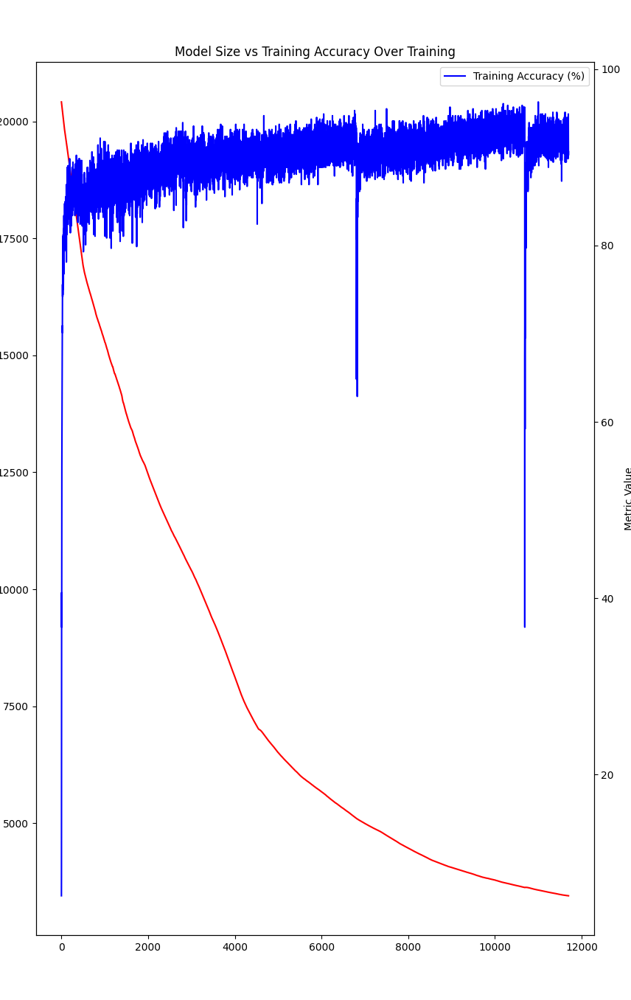

# Self-Compressing Neural Networks in JAX

This is me learning JAX by porting geohot's tinygrad [implementation](https://github.com/geohot/ai-notebooks/blob/master/mnist_self_compression.ipynb) of this [paper](https://arxiv.org/pdf/2301.13142). I'm quite curious how they compare speed-wise to the tinygrad and PyTorch versions. As this is my first touch with JAX, the code surely isn't the most optimal, so pull requests are encouraged. I will likely benchmark them and also share the results here in this repo.

After trying out Numba, Triton, and raw CUDA, JAX and raw CUDA felt the most intuitive for me sofar. So it was definitely worth implementing this.

## Bla Bla: How to Run the Code

```bash
python -m venv self-compressing-nn-jax
source self-compressing-nn-jax/bin/activate
pip install -e .
python3 train_mnist.py
```

## Bench (coming soon)
tinygrad

PyTorch

JAX

## Training run

I had some weird drops in this run two times ... need to investigate this.


